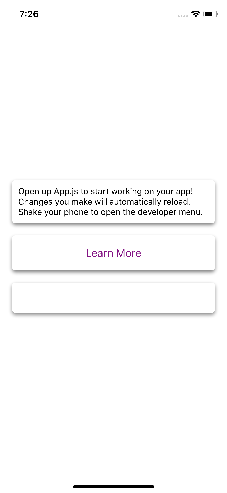

# react-native-shadow-cards
Simple and animated radio button component for React Native


Screenshot
---




## Installation

```sh
npm i --save react-native-shadow-cards
```

# Usage

```js
import {Card} from 'react-native-shadow-cards';

render(){
  return (
    <View style={styles.container}>
      <Card style={{padding: 10, margin: 10}}>
        <Text>Open up App.js to start working on your app!</Text>
        <Text>Changes you make will automatically reload.</Text>
        <Text>Shake your phone to open the developer menu.</Text>
      </Card>
      <Card style={{padding: 10, margin: 10}}>
        <Button
          onPress={()=>{}}
          title="Learn More"
          color="#841584"
          accessibilityLabel="Learn more about this purple button"
        />
      </Card>
      <Card style={{padding: 10, margin: 10, height: 50}}>
      </Card>
    </View>
  );
}
```

### Configuration
##### Card:
| Property | Type | Default | Description |
|---------------|----------|-------------|----------------------------------------------------------------|
| backgroundColor | string | '#ffffff' | card background color |
| elevation | number | 3 | An attribute to set the elevation of the card, increases 'drop-shadow' of the card |
| cornerRadius | number | 5 | Set the radius of the card |
| opacity | number | 0.5 | Set the opacity of the card |

# Contributing
Of course! Welcome :)

You can use following command in `example` dir:
